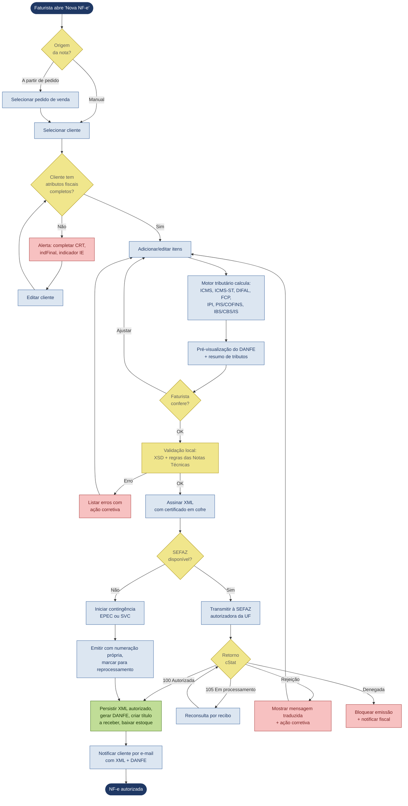
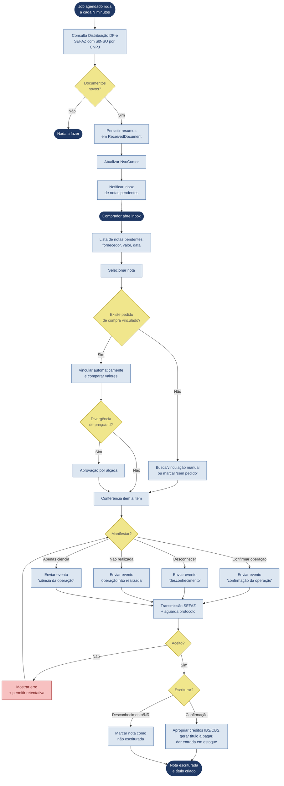
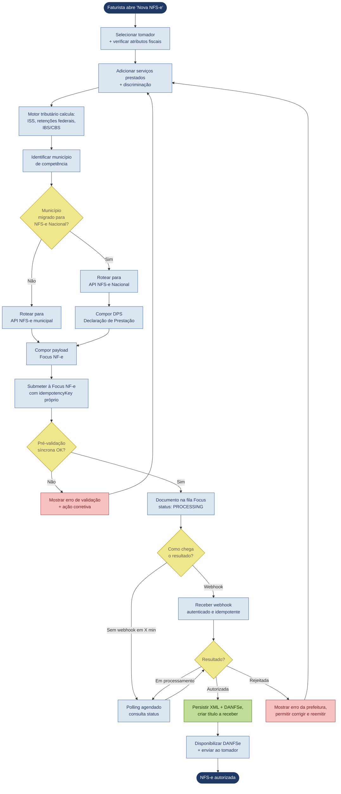
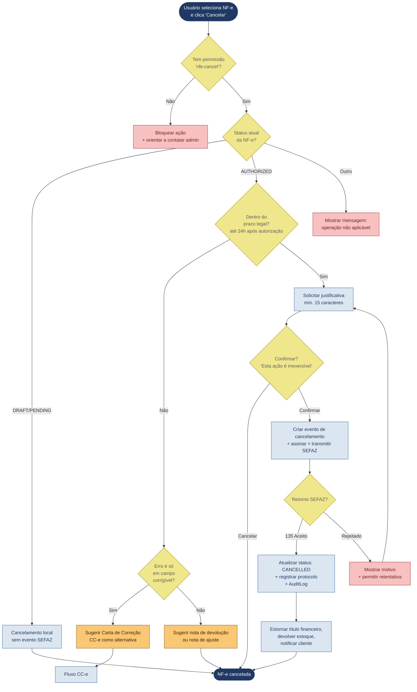
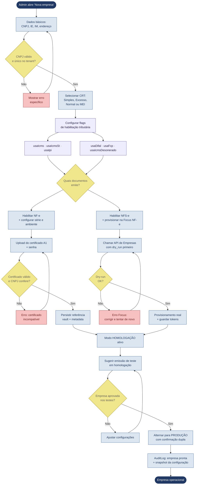
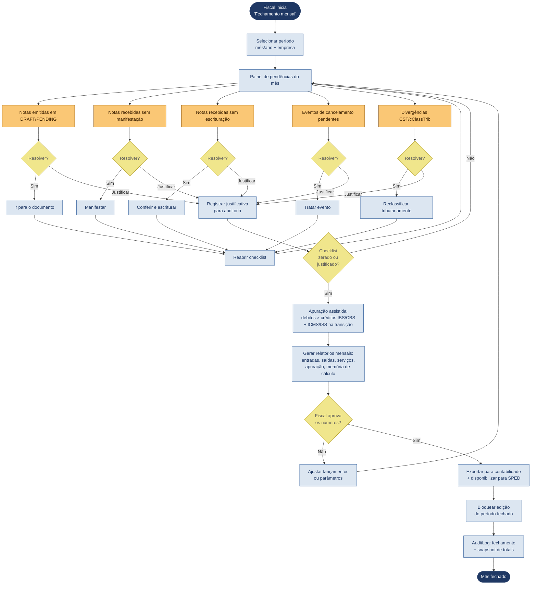

# Fluxogramas UX — Sistema Fiscal-Financeiro

> Derivado do **PRD v1.3** e do **schema Prisma v1.1** do produto.
> Combina visão executiva (mapa geral) e fluxos de tarefa críticos (operação real).

---

## 1. Mapa de Jornada Geral

Visão executiva: as grandes áreas do produto e como o usuário navega entre elas a partir do login. Cada perfil de acesso (RBAC) vê um subconjunto destas áreas conforme suas permissões.

```mermaid
flowchart TD
    Login([Login + MFA]) --> SelEmp{Múltiplas<br/>empresas?}
    SelEmp -->|Sim| EscEmp[Selecionar empresa]
    SelEmp -->|Não| Dash
    EscEmp --> Dash[Dashboard inicial]

    Dash --> Vendas[Vendas e Faturamento]
    Dash --> Compras[Compras]
    Dash --> Fiscal[Fiscal e Documentos]
    Dash --> Financeiro[Financeiro]
    Dash --> Relatorios[Relatórios]
    Dash --> Admin[Administração]

    Vendas --> V1[Pedidos de venda]
    Vendas --> V2[Emitir NF-e / NFS-e]
    Vendas --> V3[Devoluções]

    Compras --> C1[Pedidos de compra]
    Compras --> C2[Conferência de entrada]
    Compras --> C3[Fornecedores]

    Fiscal --> F1[Notas emitidas]
    Fiscal --> F2[Notas recebidas + manifestação]
    Fiscal --> F3[Eventos: cancelar, CC-e, inutilizar]
    Fiscal --> F4[Apuração assistida]

    Financeiro --> Fi1[Contas a receber]
    Financeiro --> Fi2[Contas a pagar]
    Financeiro --> Fi3[Bancos e conciliação]
    Financeiro --> Fi4[Fluxo de caixa]

    Relatorios --> R1[Mensais fiscais]
    Relatorios --> R2[Gerenciais]
    Relatorios --> R3[Exportação SPED]

    Admin --> A1[Empresas e filiais]
    Admin --> A2[Usuários e perfis]
    Admin --> A3[Certificados e tokens]
    Admin --> A4[Parâmetros fiscais]
    Admin --> A5[Auditoria]

    classDef root fill:#1F3864,color:#FFFFFF,stroke:#1F3864
    classDef area fill:#DCE6F1,color:#1F3864,stroke:#2E5C9A,stroke-width:2px
    classDef leaf fill:#F2F5FA,color:#1F3864,stroke:#BFBFBF

    class Login,Dash root
    class Vendas,Compras,Fiscal,Financeiro,Relatorios,Admin area
    class V1,V2,V3,C1,C2,C3,F1,F2,F3,F4,Fi1,Fi2,Fi3,Fi4,R1,R2,R3,A1,A2,A3,A4,A5 leaf
```

---

## 2. Fluxo Crítico — Emissão de NF-e modelo 55 (direto SEFAZ)

Caminho do faturista para emitir uma NF-e. Cobre o caminho feliz e os principais desvios (pré-validação local, rejeição da SEFAZ, contingência). Reflete os requisitos NFE-01 a NFE-08 e SEF-01 a SEF-06 do PRD.

---

## 3. Fluxo Crítico — Importação de Nota de Entrada e Manifestação

Caminho do recebimento (Comprador + Fiscal). Cobre captura automática via Distribuição de DF-e da SEFAZ (NSU), conferência manual, manifestação e geração do título financeiro. Reflete ENT-01 a ENT-15 do PRD.

---

## 4. Fluxo Crítico — Emissão de NFS-e via Focus NF-e

Caminho do faturista de serviços. Diferente da NF-e: comunicação assíncrona via API REST + webhook (com polling como fallback). Reflete NFS-01 a NFS-14 e FNF-01 a FNF-08 do PRD.

---

## 5. Fluxo Crítico — Cancelamento de NF-e (com regras de prazo e auditoria)

Ação destrutiva e auditada. Cobre cancelamento dentro e fora do prazo legal e o uso de CC-e como alternativa. Reflete NFE-05 e SEF-09 do PRD.

---

## 6. Fluxo Crítico — Configuração de Empresa Nova (onboarding)

Caminho do Administrador para colocar uma empresa em produção. Cobre o setup multiempresa com flags de habilitação tributária (modelo 6.1.1 do PRD), certificado e ambiente.

---

## 7. Fluxo Crítico — Fechamento Mensal Fiscal

Caminho recorrente do Fiscal/Contábil para fechar o mês. Combina vários módulos (entradas, saídas, manifestações, apuração assistida) e termina nos relatórios e exportação. Reflete REL-01 a REL-06 do PRD.

---

## Como ler os diagramas

**Convenção de cores aplicada em todos os fluxos:**

- **Azul-marinho** — início e fim
- **Azul-claro** — ações do usuário e do sistema
- **Amarelo** — decisões (lógica condicional)
- **Vermelho** — caminhos de erro / bloqueios
- **Verde** — caminhos de sucesso
- **Outras cores semânticas** — laranja (pendências), lilás (configuração)

**Como cada fluxo se conecta ao schema Prisma:**

| Fluxo | Models principais envolvidos |
|---|---|
| 1. Mapa geral | Estrutura macro — Tenant, Company, User, UserRole, Permission |
| 2. Emissão NF-e | NFe, NFeItem, Customer, Product, ProductTaxRule, InterstateAliquot, IcmsInternaUf, IcmsStMva, SefazTransmission, NumberingSeries |
| 3. Importação entrada | ReceivedDocument, NsuCursor, DfeManifestation, Supplier, AccountPayable, StockMovement |
| 4. Emissão NFS-e | NFSe, NFSeItem, Service, ServiceTaxRule, FocusRequest, WebhookEvent, AccountReceivable |
| 5. Cancelamento | NFeEvento, NFe (status), AuditLog, AccountReceivable (estorno), StockMovement (estorno) |
| 6. Onboarding | Company (com flags), Certificate, IntegrationCredential, AuditLog |
| 7. Fechamento mensal | NFe, NFSe, ReceivedDocument, DfeManifestation, TaxParameter, AuditLog |

**Próximos passos a partir destes fluxos:**

1. Validar cada fluxo com os usuários reais (Faturista, Comprador, Fiscal, Financeiro) — fluxograma é hipótese até alguém usar
2. Derivar wireframes/mockups para as telas mais críticas (Emissão NF-e, Inbox de notas recebidas, Checklist de fechamento)
3. Mapear cada nó de erro/decisão para uma mensagem de UI específica — é onde a diferença entre "funciona" e "é usável" aparece
4. Cobertura de testes E2E: cada caminho do diagrama vira pelo menos um caso de teste
